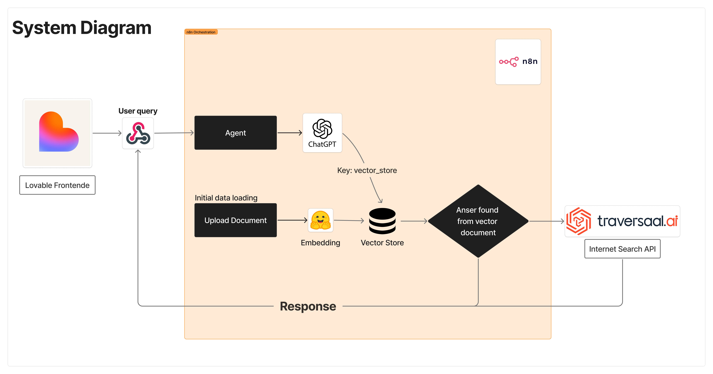
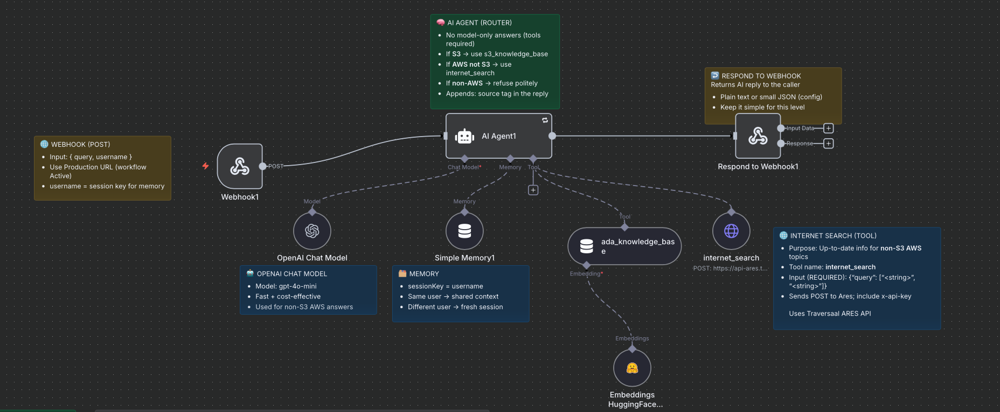

# Legal-Support-Agent-Chatbot---n8n-Workflow

# ADA & Legal Helper (LLM · AI PM Case)

**One-liner:** An AI-powered assistant that grounds ADA guidance in authoritative text and helps users gather the right facts *before* consulting an attorney.  
**Role:** AI Product Manager & LLM Engineer · **Status:** MVP live  
**Stack:** Lovable (UI), n8n (orchestration), OpenAI Chat, Lightweight RAG (vector store), Traversaal Search API, Webhooks

---

## Problem
ADA law in the U.S. is nuanced and context-dependent. Navigating government sites is time-consuming, and teams struggle to translate rules into case-specific actions. **ADA & Legal Helper** provides plain-language answers grounded in ADA text and organizes the information a user should collect prior to legal consultation. *(Not a substitute for legal advice.)*

---

## ICP (Ideal Customer Profile)
- **HR professionals** handling accommodations, recruiting policy, and workplace compliance  
- **Accessibility / DEI coordinators** covering physical, digital, and procedural accessibility  
- **Public-sector staff** responsible for ADA obligations across city services, schools, or public websites  
- **University admins & federal contractors** managing federally funded program requirements  
- **Managers / supervisors** making day-to-day accommodation decisions  
- **Employees** checking whether a workplace scenario aligns with ADA and what to do next

---

## Architecture at a Glance
> *(Insert diagram here)*  
> Frontend (Lovable) → Webhook → **n8n Router** →  
> • **Lightweight RAG** on ADA 1990 (vector store) **or**  
> • **Internet Search** via Traversaal →  
> **OpenAI Chat** synthesis → Response to UI with sources & next-steps

---

## How It Works
1. **User asks a question** in Lovable’s conversational UI.  
2. **Webhook → n8n** triggers routing and validation.  
3. **Routing:** ADA-specific queries go to **RAG**; broader legal questions go to **live search**.  
4. **Grounded synthesis:** The LLM composes an answer with citations (sections/links).  
5. **Return to UI:** The app shows a clear explanation plus sources and actionable next steps.

---

## Product Differentiators (What makes it work)
- **Lightweight RAG for efficiency:**  
  The ADA corpus is static and compact, so retrieval is fast and cheap while maintaining fidelity. This replaces hours of manual reading with seconds-level grounded answers.

- **Iterative clarification with memory:**  
  A short **session memory** enables repeated **clarification** without losing context (e.g., role, jurisdiction, requested accommodation). This drives faster convergence on the user’s specific legal situation.

- **Search fallback for coverage:**  
  When a query goes beyond ADA scope, the system automatically uses **live internet search** to surface relevant public sources, keeping guidance current.

---

## Client-Side Experience for Legal *Interpretation* (beyond “information search”)
- **Auto-generated clarification prompts after the first answer**  
  The assistant proposes what information is still needed (e.g., employer size, job function, modality, prior accommodations) to reach a more precise interpretation.

- **Seamless user input for clarifications**  
  Users can supply missing details inline, tightening the loop without starting over.

- **Checklists and source bundles**  
  The UI presents a **checklist** of items to gather and a **sources panel** aggregating cited sections. This mitigates typical “chat context drift” by keeping evidence and next steps persistent and scannable as the conversation grows.

---

## Links
- **Live App:** https://ada-law-bot.lovable.app/  
- **RAG Endpoint (n8n Webhook):** `https://ethanhong.app.n8n.cloud/webhook/d82c3854-146b-4212-b94e-5b0ca8d7075b`  
- **Demo Videos:** *(add links)*

